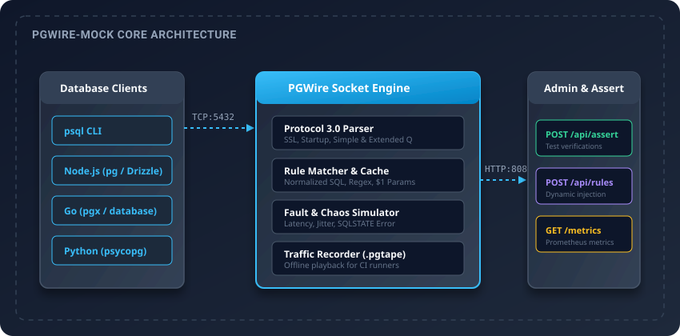

# PGWire-Mock

Fast PostgreSQL Protocol 3.0 mock socket server and recording proxy for automated testing and CI pipelines.

Starting PostgreSQL in Docker for continuous integration suites requires 10 to 45 seconds and consumes hundreds of megabytes of memory. PGWire-Mock starts in under one millisecond, uses less than 10MB of RAM, and speaks the native PostgreSQL wire protocol over TCP. Client libraries, query builders, and ORMs connect directly without code changes.



## Features

- **Wire protocol compatibility**: Implements PostgreSQL Frontend/Backend Protocol 3.0 over standard TCP sockets (default port 5432).
- **Simple and extended query support**: Handles Simple Query (`'Q'`) as well as Extended Query (`Parse`, `Bind`, `Describe`, `Execute`, `Sync`) with parameter placeholders (`$1`, `$2`). Works with Prisma, Drizzle, GORM, Go pgx, and Python psycopg.
- **ORM auto-introspection**: Intercepts common catalog queries (`pg_type`, `pg_class`, `pg_namespace`, `information_schema.tables`, `current_schema()`) so connection pools connect without configuration.
- **Dynamic response templating**: Inject generated values using template tags (`{{uuid}}`, `{{now}}`, `{{today}}`, `{{param 1}}`, `{{sequence}}`, `{{random min max}}`, `{{email}}`).
- **In-memory stateful table store**: Optional `--stateful` mode provides an in-memory SQL database for `CREATE TABLE`, `INSERT`, `SELECT`, `UPDATE`, and `DELETE`.
- **Rule engine**: Match incoming queries using exact SQL, normalized SQL, regular expressions, or expected parameter values defined in YAML or JSON files.
- **Binary wire encoding**: Supports binary format code (1) encoding for standard types (`int2`, `int4`, `int8`, `float4`, `float8`, `bool`, `bytea`).
- **TLS and SSL support**: Handles `sslmode=require` with automatic in-memory self-signed certificates or custom PEM keys.
- **Embedded real-time web dashboard**: Dark-mode dashboard at `/dashboard` with Server-Sent Events (SSE) streaming live queries and interactive rule testing.
- **Embedded HTTP admin and assertion API**: Test runners query the server at runtime (`POST /api/rules`, `GET /api/queries`, `POST /api/assert`, `POST /api/reset`) to verify call counts and parameter bindings.
- **Test SDKs for JS and Python**: Zero-dependency packages for Jest, Vitest, and PyTest (`sdk/js`, `sdk/python`).
- **Traffic recording and offline replay**: Proxy client traffic to a live PostgreSQL server and save sessions to portable `.pgtape` files for offline playback in isolated environments.
- **Prometheus metrics**: Standard `/metrics` endpoint reports active connections, total query volume, and registered rule counts.

## Installation

### Prebuilt binary

Download the latest binary for your operating system from the releases page:

```bash
# Linux amd64
curl -Lo pgwire-mock https://github.com/alexandrmotologa/pgwire-mock/releases/latest/download/pgwire-mock-linux-amd64
chmod +x pgwire-mock
sudo mv pgwire-mock /usr/local/bin/

# macOS arm64
curl -Lo pgwire-mock https://github.com/alexandrmotologa/pgwire-mock/releases/latest/download/pgwire-mock-darwin-arm64
chmod +x pgwire-mock
sudo mv pgwire-mock /usr/local/bin/
```

### From source

Requires Go 1.22 or higher:

```bash
go install github.com/alexandrmotologa/pgwire-mock/cmd/pgwire-mock@latest
```

## Quick start

### 1. Start the mock server

Start the server using an example rule set:

```bash
pgwire-mock --port 5432 --rules examples/rules_ecommerce.yaml -v
```

Output:

```text
==============================================================
 PGWire-Mock v1.0.0 - PostgreSQL Protocol Mock Server
==============================================================
 PostgreSQL Mock Socket : localhost:5432
 HTTP Admin & Assert API: http://localhost:8080
 Prometheus Metrics     : http://localhost:8080/metrics
 Active Mock Rules      : 5
--------------------------------------------------------------
 Connect with psql:
   psql -h localhost -p 5432 -U postgres -d testdb
==============================================================
```

### 2. Connect with standard clients

Connect using `psql`:

```bash
psql -h localhost -p 5432 -U postgres -d testdb
```

Query the mock server:

```sql
testdb=> SELECT id, title, price_cents, stock_count FROM products WHERE active = true ORDER BY id ASC;
 id  |              title               | price_cents | stock_count 
-----+----------------------------------+-------------+-------------
 101 | Mechanical Keyboard RGB          |       14900 |          25
 102 | Ultra-Wide Gaming Monitor 34"    |       49900 |          12
 103 | Ergonomic Desk Chair             |       29900 |           8
(3 rows)
```

## Defining mock rules

Rules are defined in YAML or JSON files:

```yaml
rules:
  # Exact query matching with columns and types
  - id: list-products
    query: "SELECT id, title, price FROM products"
    columns: ["id", "title", "price"]
    types: [23, 25, 23] # int4, text, int4
    rows:
      - ["1", "Keyboard", "9900"]
      - ["2", "Mouse", "4900"]
    tag: "SELECT 2"

  # Parameterized query matching ($1 parameter)
  - id: user-by-id
    query: "SELECT id, email, role FROM users WHERE id = $1"
    params: ["1"]
    columns: ["id", "email", "role"]
    rows:
      - ["1", "alex@mtlg.site", "admin"]
    tag: "SELECT 1"

  # Error simulation
  - id: duplicate-key-error
    query: "INSERT INTO users (email) VALUES ($1)"
    params: ["existing@example.com"]
    error:
      code: "23505"
      severity: "ERROR"
      message: "duplicate key value violates unique constraint \"users_email_key\""
      detail: "Key (email)=(existing@example.com) already exists."

  # Latency simulation
  - id: slow-query
    query: "SELECT * FROM large_report"
    columns: ["metric", "val"]
    rows:
      - ["total", "100"]
    latency_ms: 200
    jitter_ms: 50
```

## Using the admin API in tests

Your test runner can inject rules and verify assertions over HTTP:

### Inject a mock rule

```bash
curl -X POST http://localhost:8080/api/rules \
  -H "Content-Type: application/json" \
  -d '{
    "id": "temp-order",
    "query": "SELECT status FROM orders WHERE id = $1",
    "params": ["100"],
    "columns": ["status"],
    "rows": [["shipped"]]
  }'
```

### Assert query execution

Verify that your application executed a specific query with expected parameters:

```bash
curl -X POST http://localhost:8080/api/assert \
  -H "Content-Type: application/json" \
  -d '{
    "query": "SELECT status FROM orders WHERE id = $1",
    "count": 1,
    "exact_params": ["100"]
  }'
```

### Reset state between tests

```bash
curl -X POST http://localhost:8080/api/reset
```

## Dynamic response templating

You can generate realistic IDs, timestamps, and echo input parameters in mock rows:

```yaml
rules:
  - id: create-order
    query: "INSERT INTO orders (item, amount) VALUES ($1, $2)"
    columns: ["id", "item", "amount", "created_at"]
    rows:
      - ["{{uuid}}", "{{param 1}}", "{{param 2}}", "{{now}}"]
    tag: "INSERT 0 1"
```

Available template tags:
- `{{uuid}}`: Generates random RFC 4122 v4 UUID strings.
- `{{now}}`: Current UTC timestamp (`2006-01-02 15:04:05.000000+00`). Supports offsets: `{{now - 1h}}`, `{{now + 2d}}`.
- `{{today}}`: Current UTC date (`2006-01-02`). Supports offsets: `{{today + 7d}}`.
- `{{param 1}}` or `{{param $1}}`: Evaluates to bound parameter value from `$1`.
- `{{sequence}}` or `{{seq}}`: Atomic incrementing integer counter.
- `{{random 10 100}}`: Random integer between min and max.
- `{{email}}`: Generates unique mock email addresses.

## Stateful in-memory table store

For zero-configuration test cases where you want `CREATE TABLE`, `INSERT`, `SELECT`, `UPDATE`, and `DELETE` to work like an actual database without creating static mock rules:

```bash
pgwire-mock --port 5432 --stateful
```

When `--stateful` is enabled, the server maintains tables and records in memory. Statements return real `RowDescription` and `DataRow` packets, and non-existent tables return PostgreSQL error `42P01` (relation does not exist).

## Realtime control dashboard

PGWire-Mock includes a dark-mode web dashboard embedded directly into the binary with zero external assets or npm build steps:

Open `http://localhost:8080/dashboard` in your browser to:
- Monitor live queries in real time via Server-Sent Events (SSE).
- View active connections and query throughput counters.
- Inspect, test, and register mock rules interactively.
- Trigger on-the-fly fault injection (latency, jitter, socket termination).

## Test runner SDKs

### JavaScript / TypeScript (Jest, Vitest)

Install from `sdk/js`:

```javascript
import { PGWireMock } from '@alexandrmotologa/pgwire-mock';

const mock = new PGWireMock({ adminUrl: 'http://localhost:8080' });
await mock.addRule({
  query: 'SELECT * FROM users',
  columns: ['id', 'name'],
  rows: [['1', 'Alice']],
});
```

### Python (PyTest)

Install from `sdk/python`:

```python
from pgwire_mock import PGWireMock

mock = PGWireMock(admin_url="http://localhost:8080")
mock.add_rule({
    "query": "SELECT * FROM users",
    "columns": ["id", "name"],
    "rows": [["1", "Alice"]]
})
```

## Traffic record and replay

Record live database interactions from an upstream PostgreSQL instance:

```bash
pgwire-mock --port 5432 --upstream live-db.internal:5432 --record recordings/checkout.pgtape
```

Run tests offline using the recorded tape:

```bash
pgwire-mock --port 5432 --replay recordings/checkout.pgtape
```

## CLI options

| Flag | Default | Description |
|------|---------|-------------|
| `--port`, `-p` | `5432` | PostgreSQL mock TCP listen port |
| `--admin-port` | `8080` | HTTP REST Admin, Dashboard, and Assertion API port |
| `--rules`, `-r` | `""` | Path to YAML or JSON mock rules file |
| `--stateful` | `false` | Enable in-memory stateful table CRUD storage |
| `--ssl` | `false` | Enable TLS/SSL encryption for client connections |
| `--tls-cert` | `""` | Path to TLS certificate PEM file (auto-generated if empty) |
| `--tls-key` | `""` | Path to TLS private key PEM file |
| `--upstream` | `""` | Upstream live PostgreSQL host:port for proxy mode |
| `--record` | `""` | File path to record network traffic into `.pgtape` format |
| `--replay` | `""` | File path to replay offline mock session from `.pgtape` format |
| `--verbose`, `-v` | `false` | Enable detailed debug logs for packets and queries |
| `--version` | `false` | Print version information |

## Documentation

- [Architecture Guide](docs/ARCHITECTURE.md): Internal component layout, buffer pooling, and state machine.
- [Protocol Specification](docs/PROTOCOL_GUIDE.md): PostgreSQL 3.0 wire format reference and OID table.
- [API Reference](docs/API_REFERENCE.md): Complete HTTP REST admin and assertion endpoints.
- [Contributing Guidelines](CONTRIBUTING.md): Build steps, code style, and pull request workflow.

## License

MIT License. See [LICENSE](LICENSE) for details.
